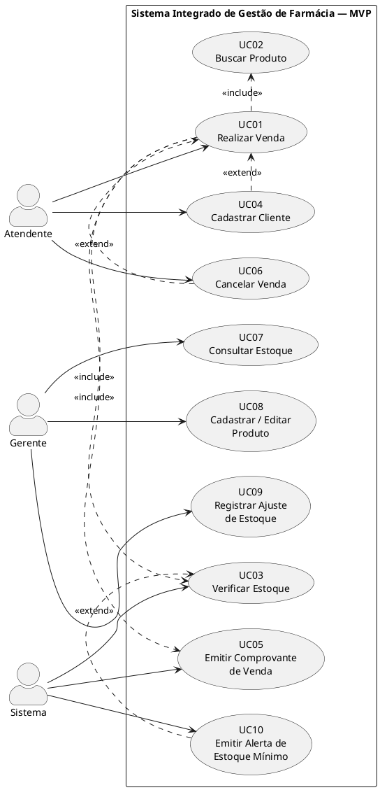
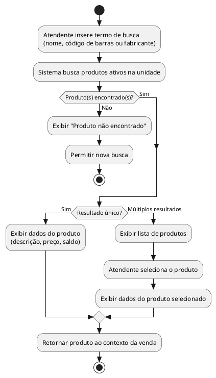
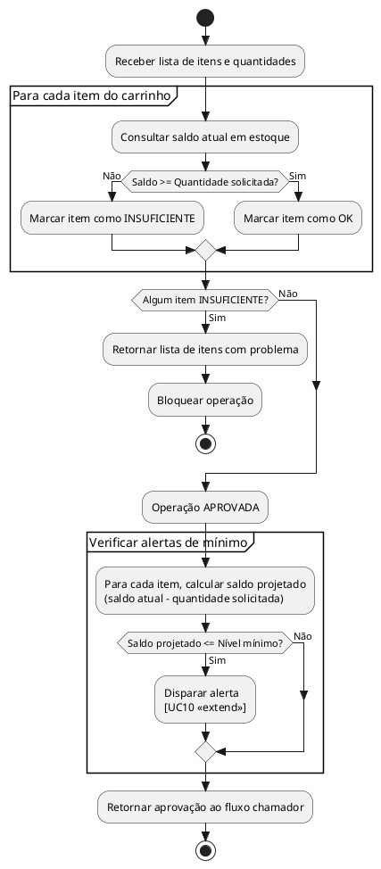
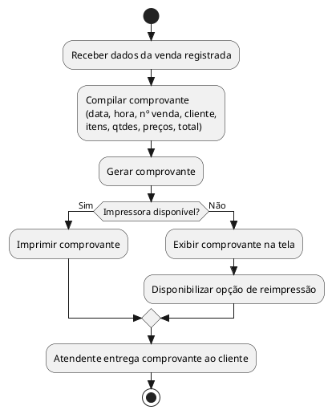
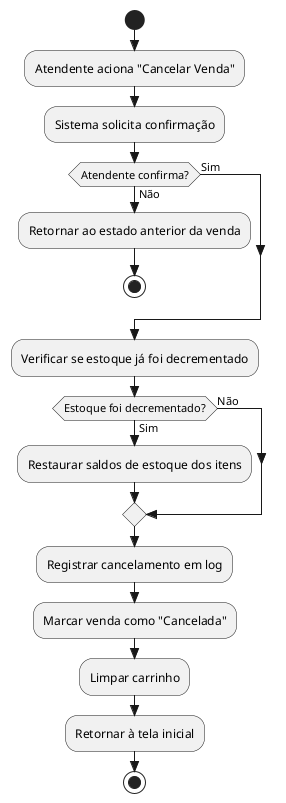
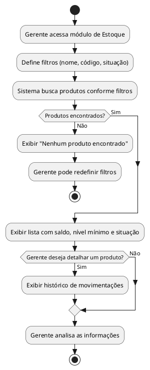
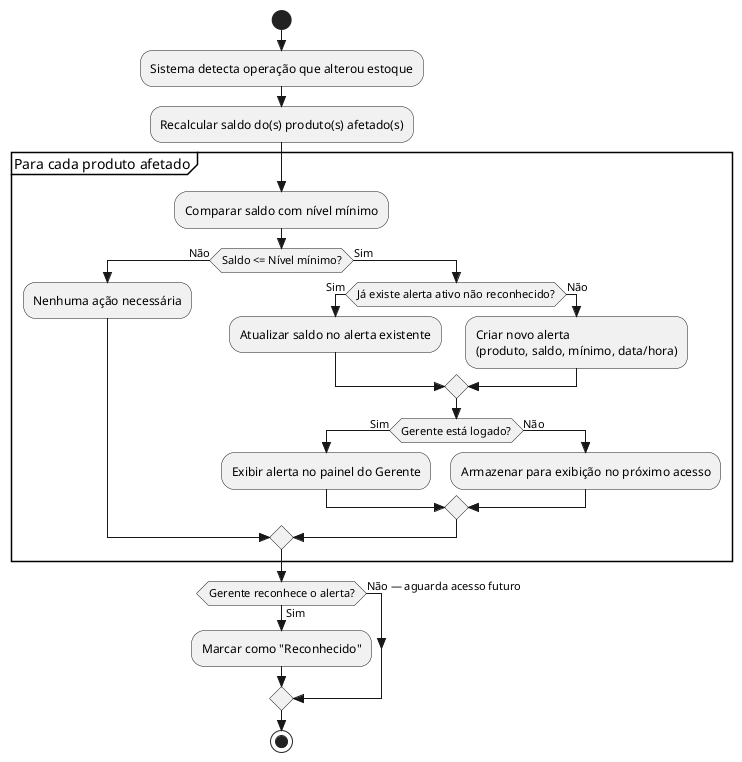

# Avaliação — Engenharia de Software
## Sistema Integrado de Gestão de Farmácia — MVP Definido pelo Estudante

**Aluno:** Joao Victor Zerbinati Cologi Pessoa
**RA:** 24001761
**Data:** 25/03/2026

---

## 1. Definição do MVP

O MVP cobre o módulo de **Operação de Vendas** e a **Gestão Básica de Estoque** por unidade. O fluxo contempla desde a identificação ou cadastro do cliente no balcão até a confirmação da venda e emissão do comprovante, incluindo cancelamento de venda, consulta e ajuste manual de estoque pelo gerente.

Ficaram de fora: vendas a prazo e convênios, Contas a Pagar/Receber, compras e fornecedores, transferências entre unidades, relatórios gerenciais, gestão de receitas de medicamentos controlados e perfis Financeiro e Administrador.

---

## 2. Regras de Negócio

**RN01 -** A venda só pode ser finalizada se todos os itens do carrinho tiverem saldo em estoque igual ou superior à quantidade solicitada. Se algum item estiver com saldo insuficiente, a operação é bloqueada e o atendente precisa ajustar as quantidades ou remover o item.

**RN02 -** O estoque é decrementado exatamente pela quantidade vendida no momento da confirmação da venda. Em caso de cancelamento, os saldos são restaurados imediatamente.

**RN03 -** O preço de venda de um produto só pode ser cadastrado ou alterado por usuários com perfil Gerente. Atendentes não têm permissão para modificar preços.

**RN04 -** Quando o saldo de um produto atingir ou ficar abaixo do nível mínimo configurado, o sistema gera um alerta automático para o gerente da unidade. O alerta não bloqueia as operações em andamento.

**RN05 -** Todo produto precisa ter os seguintes dados obrigatórios para ser ativado para venda: descrição, código de barras único, preço de venda, unidade de medida, fabricante e nível mínimo de estoque.

---

## 3. Requisitos Funcionais

**RF01 -** O sistema deve permitir buscar produtos por nome (busca parcial), código de barras ou fabricante, exibindo descrição, preço de venda e saldo em estoque da unidade.

**RF02 -** O sistema deve permitir o cadastro rápido de um novo cliente durante o atendimento, informando no mínimo nome e CPF, sem encerrar a venda em andamento.

**RF03 -** O sistema deve permitir que o atendente adicione, ajuste a quantidade e remova itens do carrinho durante uma venda, com recalculo automático do total.

**RF04 -** O sistema deve verificar o saldo em estoque de todos os itens no momento da confirmação da venda, bloqueando a finalização e indicando quais produtos estão com saldo insuficiente.

**RF05 -** O sistema deve registrar a venda com data, hora, itens, quantidades, valores unitários, total, forma de pagamento (à vista) e cliente, e emitir um comprovante imprimível ou digital.

**RF06 -** O estoque da unidade deve ser decrementado automaticamente ao confirmar a venda. Em caso de cancelamento, os saldos são restaurados.

**RF07 -** O gerente deve conseguir cadastrar e editar produtos (descrição, código de barras, preço, unidade de medida, fabricante e nível mínimo) e registrar ajustes manuais de estoque, com justificativa obrigatória.

**RF08 -** O sistema deve emitir alertas automáticos ao gerente quando o saldo de algum produto da unidade atingir ou cair abaixo do nível mínimo, exibindo o produto e o saldo atual.

---

## 4. Requisitos Não Funcionais

**RNF01 - Desempenho:** A busca de produtos e a confirmação de venda devem responder em no máximo 2 segundos em condições normais de operação na rede local da farmácia.

**RNF02 - Segurança:** O acesso exige autenticação por usuário e senha. Toda operação é registrada em log com identificação do usuário, data e hora, para fins de rastreabilidade e auditoria.

**RNF03 - Usabilidade:** A interface do balcão deve ser operável predominantemente por teclado e leitora de código de barras, com no máximo 4 telas para concluir uma venda completa.

**RNF04 - Confiabilidade:** O registro da venda e a atualização do estoque devem ser operações atômicas (ACID). Se ocorrer falha em qualquer etapa, ambas as operações são revertidas, prevenindo inconsistências.

---

## 5. Casos de Uso

| ID | Nome | Ator(es) Principal(is) |
|----|------|------------------------|
| UC01 | Realizar Venda | Atendente |
| UC02 | Buscar Produto | Atendente |
| UC03 | Verificar Estoque | Sistema |
| UC04 | Cadastrar Cliente | Atendente |
| UC05 | Emitir Comprovante de Venda | Sistema |
| UC06 | Cancelar Venda | Atendente |
| UC07 | Consultar Estoque | Gerente |
| UC08 | Cadastrar / Editar Produto | Gerente |
| UC09 | Registrar Ajuste de Estoque | Gerente |
| UC10 | Emitir Alerta de Estoque Mínimo | Sistema |

**Relacionamentos:**
- `<<include>>`: UC01 -> UC02, UC01 -> UC03, UC01 -> UC05
- `<<extend>>`: UC04 -> UC01, UC06 -> UC01, UC10 -> UC03

### Diagrama de Casos de Uso



---

## 6. Documentação dos Casos de Uso

---

### UC01 - Realizar Venda

**Ator(es):** Atendente

**Descrição:** Processo completo de atendimento no balcão, desde a identificação do cliente e montagem do carrinho até a confirmação do pagamento e emissão do comprovante.

**Pré-condições:**
- O atendente está autenticado no sistema.
- Há produtos ativos cadastrados com estoque disponível.

**Pós-condições:**
- A venda está registrada com todos os itens, valores e dados do cliente.
- O estoque foi decrementado para cada item vendido.
- O comprovante foi emitido.

**Fluxo Principal:**
1. O atendente inicia uma nova venda.
2. O atendente identifica o cliente por CPF ou nome, ou informa que é venda sem cadastro.
3. O sistema exibe os dados do cliente encontrado.
4. O atendente busca o produto (`<<include>>` UC02).
5. O sistema exibe o produto com preço e saldo.
6. O atendente informa a quantidade e adiciona ao carrinho.
7. Os passos 4 a 6 se repetem para cada produto adicional.
8. O atendente solicita a confirmação da venda.
9. O sistema verifica o estoque de todos os itens (`<<include>>` UC03).
10. O sistema registra a venda e decrementa os estoques.
11. O sistema emite o comprovante (`<<include>>` UC05).

**Fluxos Alternativos / Exceções:**

- **FA01 -** Se o cliente não estiver cadastrado, o atendente aciona o cadastro rápido (`<<extend>>` UC04). Após o cadastro, o fluxo retorna ao passo 3.
- **FA02 -** Se algum item estiver com saldo insuficiente no passo 9, o sistema indica o produto com problema. O atendente pode reduzir a quantidade, remover o item ou cancelar a venda.
- **FA03 -** Se o carrinho estiver vazio no passo 8, o sistema bloqueia a confirmação e exibe mensagem de erro.
- **FA04 -** O atendente pode cancelar a venda a qualquer momento (`<<extend>>` UC06), descartando o pedido sem registrar a operação.

**Relacionamentos:**
- Include: UC02, UC03, UC05
- Extend: UC04, UC06

#### Diagrama de Atividades - UC01

```plantuml
@startuml AtividadeUC01_RealizarVenda

skinparam style strictuml
start

:Atendente inicia nova venda;
:Identificar cliente (CPF/nome);

if (Cliente encontrado?) then (Não)
  :Cadastrar cliente rapidamente\n[UC04 <<extend>>];
else (Sim)
  :Exibir dados do cliente;
endif

repeat
  :Buscar produto\n[UC02 <<include>>];
  :Exibir produto (preço + saldo);
  :Atendente informa quantidade\ne adiciona ao carrinho;
repeat while (Adicionar mais itens?) is (Sim)
->Não;

if (Carrinho vazio?) then (Sim)
  :Exibir erro — carrinho vazio;
  stop
else (Não)
endif

:Atendente solicita confirmação da venda;

if (Cancelar venda?) then (Sim)
  :Cancelar venda\n[UC06 <<extend>>];
  stop
else (Não)
endif

:Verificar estoque de todos os itens\n[UC03 <<include>>];

if (Estoque suficiente para todos os itens?) then (Não)
  :Exibir produto(s) com saldo insuficiente;
  :Atendente ajusta quantidade ou remove item;
  goto :Atendente solicita confirmação da venda;
else (Sim)
endif

:Registrar venda;
:Decrementar estoque de cada item;
:Emitir comprovante\n[UC05 <<include>>];

stop
@enduml
```

---

### UC02 - Buscar Produto

**Ator(es):** Atendente

**Descrição:** Localiza um produto ativo no catálogo da unidade por nome parcial, código de barras ou fabricante, retornando os dados para seleção e inclusão no carrinho.

**Pré-condições:**
- O atendente está em uma venda ativa.
- Existem produtos ativos cadastrados.

**Pós-condições:**
- O produto é selecionado e seus dados (descrição, preço e saldo) são exibidos para o atendente.

**Fluxo Principal:**
1. O atendente informa o termo de busca (nome parcial, código de barras ou fabricante).
2. O sistema realiza a busca nos produtos ativos da unidade.
3. O sistema exibe a lista com descrição, preço e saldo em estoque.
4. O atendente seleciona o produto desejado.
5. O sistema retorna os dados do produto para o carrinho.

**Fluxos Alternativos / Exceções:**

- **FA01 -** Se nenhum resultado for encontrado, o sistema exibe "Produto não encontrado" e permite nova busca.
- **FA02 -** Produtos inativos não aparecem nos resultados de busca durante a venda.
- **FA03 -** Se houver múltiplos resultados, o sistema lista todos e aguarda a seleção no passo 4.

**Relacionamentos:**
- Include: -
- Extend: -

#### Diagrama de Atividades - UC02



---

### UC03 - Verificar Estoque

**Ator(es):** Sistema

**Descrição:** Verifica se os saldos em estoque são suficientes para atender todos os itens e quantidades do carrinho antes da confirmação da venda.

**Pré-condições:**
- Há ao menos um item no carrinho.
- Os produtos têm registro de estoque na unidade.

**Pós-condições:**
- O sistema retorna aprovação (todos com saldo) ou bloqueio (lista de itens insuficientes).
- Se algum produto ficar abaixo do nível mínimo após a operação, o alerta é disparado.

**Fluxo Principal:**
1. O sistema recebe a lista de itens e quantidades do carrinho.
2. Para cada item, consulta o saldo atual em estoque da unidade.
3. Compara o saldo com a quantidade solicitada.
4. Se todos os itens têm saldo suficiente, aprova a operação.
5. Verifica se algum produto ficará abaixo do mínimo após a venda.
6. Se houver produto abaixo do mínimo, dispara o alerta (`<<extend>>` UC10).
7. Retorna o resultado ao fluxo chamador.

**Fluxos Alternativos / Exceções:**

- **FA01 -** Se qualquer item não tiver saldo suficiente, o sistema identifica os produtos problemáticos, bloqueia a aprovação e retorna a lista de itens com problema para o UC01.
- **FA02 -** Se um produto não tiver registro de estoque na unidade, o sistema trata como saldo zero e bloqueia o item.

**Relacionamentos:**
- Include: -
- Extend: UC10

#### Diagrama de Atividades - UC03



---

### UC04 - Cadastrar Cliente

**Ator(es):** Atendente

**Descrição:** Registra um novo cliente durante o atendimento, coletando os dados mínimos necessários sem interromper o fluxo de venda.

**Pré-condições:**
- O atendente está em uma venda ativa.
- O CPF informado não possui cadastro existente no sistema.

**Pós-condições:**
- O cliente é criado e vinculado à venda em andamento.

**Fluxo Principal:**
1. O atendente aciona a opção de cadastrar novo cliente.
2. O sistema exibe o formulário mínimo (nome e CPF).
3. O atendente preenche os dados.
4. O sistema valida o formato do CPF.
5. O sistema confirma que o CPF não pertence a outro cadastro.
6. O sistema salva o novo cliente.
7. O cliente é vinculado automaticamente à venda em andamento.
8. O fluxo retorna ao ponto de origem no UC01.

**Fluxos Alternativos / Exceções:**

- **FA01 -** Se o formato do CPF for inválido, o sistema exibe mensagem de erro e solicita novo preenchimento.
- **FA02 -** Se o CPF já pertencer a um cliente cadastrado, o sistema vincula o cliente existente à venda e exibe aviso.
- **FA03 -** O atendente pode cancelar o cadastro a qualquer momento e prosseguir com a venda sem vincular cliente.

**Relacionamentos:**
- Include: -
- Extend: estende UC01

#### Diagrama de Atividades - UC04

```plantuml
@startuml AtividadeUC04_CadastrarCliente

skinparam style strictuml
start

:Atendente aciona "Cadastrar novo cliente";
:Exibir formulário mínimo (Nome, CPF);
:Atendente preenche os dados;

if (Atendente cancela cadastro?) then (Sim)
  :Retornar à venda sem vincular cliente;
  stop
else (Não)
endif

:Validar formato do CPF;

if (CPF com formato válido?) then (Não)
  :Exibir "CPF inválido";
  -> Atendente corrige;
  goto :Atendente preenche os dados;
else (Sim)
endif

:Verificar se CPF já existe no sistema;

if (CPF já cadastrado?) then (Sim)
  :Exibir "Cliente já cadastrado";
  :Vincular cliente existente à venda;
else (Não)
  :Salvar novo cliente;
  :Vincular à venda;
endif

:Retornar ao fluxo UC01;

stop
@enduml
```

---

### UC05 - Emitir Comprovante de Venda

**Ator(es):** Sistema

**Descrição:** Gera e disponibiliza o comprovante da venda confirmada com todos os dados da operação. É sempre executado ao término bem-sucedido de uma venda.

**Pré-condições:**
- A venda foi confirmada e registrada com sucesso.
- O estoque já foi atualizado.

**Pós-condições:**
- O comprovante foi gerado e entregue ao cliente (impresso ou digital).

**Fluxo Principal:**
1. O sistema recebe a confirmação da venda registrada.
2. Compila os dados: data, hora, número da venda, cliente, itens, quantidades, preços, total e forma de pagamento.
3. Gera o comprovante no formato configurado.
4. Exibe o comprovante ao atendente.
5. O atendente entrega o comprovante ao cliente.

**Fluxos Alternativos / Exceções:**

- **FA01 -** Se a impressora estiver indisponível, o sistema exibe o comprovante na tela e oferece a opção de reimprimir quando a impressora estiver disponível. A venda permanece registrada normalmente.
- **FA02 -** O atendente pode solicitar reimpressão do último comprovante a qualquer momento após a venda.

**Relacionamentos:**
- Include: -
- Extend: -

#### Diagrama de Atividades - UC05



---

### UC06 - Cancelar Venda

**Ator(es):** Atendente

**Descrição:** Permite ao atendente desistir de uma venda em andamento antes da confirmação, descartando o carrinho. Se a venda já havia sido confirmada e o estoque decrementado, os saldos são restaurados.

**Pré-condições:**
- Existe uma venda em andamento ou recém-confirmada.
- O atendente está autenticado.

**Pós-condições:**
- A venda é cancelada e não é registrada (ou é marcada como "Cancelada" para fins de auditoria).
- Se o estoque havia sido decrementado, os saldos são restaurados.

**Fluxo Principal:**
1. O atendente aciona a opção "Cancelar Venda".
2. O sistema solicita confirmação do cancelamento.
3. O atendente confirma.
4. O sistema verifica se o estoque já havia sido decrementado.
5. Se sim, os saldos de estoque são restaurados.
6. O sistema registra o cancelamento em log.
7. O carrinho é limpo e o sistema retorna à tela inicial de venda.

**Fluxos Alternativos / Exceções:**

- **FA01 -** Se o atendente não confirmar o cancelamento no passo 3, o sistema retorna ao estado anterior da venda sem nenhuma alteração.
- **FA02 -** O cancelamento de venda já finalizada é registrado em log com usuário, data e hora para rastreabilidade.

**Relacionamentos:**
- Include: -
- Extend: estende UC01

#### Diagrama de Atividades - UC06



---

### UC07 - Consultar Estoque

**Ator(es):** Gerente

**Descrição:** Permite ao gerente visualizar o saldo atual de estoque dos produtos da unidade, com filtros por nome, código ou situação (normal ou abaixo do mínimo).

**Pré-condições:**
- O gerente está autenticado no sistema.
- Existem produtos com registro de estoque na unidade.

**Pós-condições:**
- O gerente visualiza os saldos conforme o filtro aplicado.

**Fluxo Principal:**
1. O gerente acessa o módulo de Estoque.
2. Aplica filtros opcionais (nome, código, situação).
3. O sistema exibe a lista de produtos com saldo atual, nível mínimo e situação (normal/crítico).
4. O gerente analisa as informações.

**Fluxos Alternativos / Exceções:**

- **FA01 -** Se nenhum produto for encontrado com o filtro aplicado, o sistema exibe mensagem e permite redefinir os filtros.
- **FA02 -** O gerente pode clicar em um produto específico para visualizar seu histórico de movimentações (entradas e saídas).

**Relacionamentos:**
- Include: -
- Extend: -

#### Diagrama de Atividades - UC07



---

### UC08 - Cadastrar / Editar Produto

**Ator(es):** Gerente

**Descrição:** Permite ao gerente criar novos produtos no catálogo ou atualizar informações de produtos existentes, incluindo dados obrigatórios para ativação.

**Pré-condições:**
- O gerente está autenticado no sistema.
- Para edição: o produto já existe no catálogo.

**Pós-condições:**
- O produto é criado ou atualizado e, se todos os dados obrigatórios estiverem preenchidos, fica disponível para venda.

**Fluxo Principal:**
1. O gerente acessa o módulo de Produtos.
2. Escolhe "Novo Produto" ou pesquisa um produto existente para edição.
3. O sistema exibe o formulário com os campos: descrição, código de barras, preço, unidade de medida, fabricante, nível mínimo e status (Ativo/Inativo).
4. O gerente preenche ou atualiza os campos.
5. O gerente aciona "Salvar".
6. O sistema valida os dados.
7. O produto é salvo e o sistema exibe confirmação.

**Fluxos Alternativos / Exceções:**

- **FA01 -** Se campos obrigatórios estiverem ausentes, o sistema os destaca e impede o salvamento.
- **FA02 -** Se o código de barras já pertencer a outro produto, o sistema exibe mensagem de erro.
- **FA03 -** Se o preço for zero ou negativo, o sistema exibe mensagem de valor inválido.
- **FA04 -** O gerente pode inativar um produto alterando seu status para "Inativo", impedindo que apareça em novas vendas.

**Relacionamentos:**
- Include: -
- Extend: -

#### Diagrama de Atividades - UC08

```plantuml
@startuml AtividadeUC08_CadastrarEditarProduto

skinparam style strictuml
start

:Gerente acessa módulo de Produtos;

if (Nova criação ou edição?) then (Novo produto)
  :Exibir formulário em branco;
else (Editar existente)
  :Gerente pesquisa produto;
  :Sistema exibe formulário com dados atuais;
endif

:Gerente preenche / atualiza campos\n(descrição, código de barras, preço,\nunidade, fabricante, nível mínimo, status);
:Gerente aciona "Salvar";
:Sistema valida dados;

if (Campos obrigatórios preenchidos?) then (Não)
  :Destacar campos faltantes;
  -> Gerente corrige;
  goto :Gerente preenche / atualiza campos\n(descrição, código de barras, preço,\nunidade, fabricante, nível mínimo, status);
else (Sim)
endif

if (Código de barras único?) then (Não)
  :Exibir "Código de barras já cadastrado";
  -> Gerente corrige;
  goto :Gerente preenche / atualiza campos\n(descrição, código de barras, preço,\nunidade, fabricante, nível mínimo, status);
else (Sim)
endif

if (Preço > 0?) then (Não)
  :Exibir "Preço inválido";
  -> Gerente corrige;
  goto :Gerente preenche / atualiza campos\n(descrição, código de barras, preço,\nunidade, fabricante, nível mínimo, status);
else (Sim)
endif

:Sistema salva produto;
:Exibir confirmação de sucesso;

stop
@enduml
```

---

### UC09 - Registrar Ajuste de Estoque

**Ator(es):** Gerente

**Descrição:** Permite ao gerente registrar variações manuais no estoque não decorrentes de vendas, como perdas, quebras ou acertos de inventário, com justificativa obrigatória para rastreabilidade.

**Pré-condições:**
- O gerente está autenticado no sistema.
- O produto a ser ajustado existe e está ativo.

**Pós-condições:**
- O saldo de estoque do produto é atualizado conforme o ajuste.
- A movimentação é registrada em log com tipo, quantidade, justificativa, usuário, data e hora.

**Fluxo Principal:**
1. O gerente acessa o módulo de Estoque e seleciona "Ajuste Manual".
2. O gerente pesquisa e seleciona o produto.
3. O sistema exibe o saldo atual.
4. O gerente informa o tipo de ajuste (Perda/Quebra ou Acerto de Inventário), a quantidade e a justificativa.
5. O gerente confirma o ajuste.
6. O sistema valida os dados.
7. O saldo de estoque é atualizado.
8. A movimentação é registrada em log.
9. O sistema exibe o novo saldo e confirmação.

**Fluxos Alternativos / Exceções:**

- **FA01 -** Se a quantidade informada for zero ou negativa, o sistema exibe erro e retorna ao passo 4.
- **FA02 -** Se a justificativa estiver em branco, o sistema bloqueia o ajuste e retorna ao passo 4.
- **FA03 -** Se o ajuste resultar em saldo negativo, o sistema exibe aviso e solicita confirmação explícita do gerente antes de prosseguir.

**Relacionamentos:**
- Include: -
- Extend: -

#### Diagrama de Atividades - UC09

```plantuml
@startuml AtividadeUC09_RegistrarAjusteEstoque

skinparam style strictuml
start

:Gerente acessa "Ajuste Manual de Estoque";
:Pesquisar e selecionar o produto;
:Sistema exibe saldo atual;
:Gerente informa tipo de ajuste, quantidade\ne justificativa;
:Gerente confirma o ajuste;
:Sistema valida os dados;

if (Quantidade > 0?) then (Não)
  :Exibir "Quantidade inválida";
  -> Gerente corrige;
  goto :Gerente informa tipo de ajuste, quantidade\ne justificativa;
else (Sim)
endif

if (Justificativa preenchida?) then (Não)
  :Exibir "Justificativa obrigatória";
  -> Gerente corrige;
  goto :Gerente informa tipo de ajuste, quantidade\ne justificativa;
else (Sim)
endif

if (Saldo resultante seria negativo?) then (Sim)
  :Exibir aviso "Saldo ficará negativo";
  if (Gerente confirma mesmo assim?) then (Não)
    :Cancelar ajuste;
    stop
  else (Sim)
  endif
else (Não)
endif

:Atualizar saldo de estoque;
:Registrar movimentação em log;
:Exibir novo saldo e confirmação;

stop
@enduml
```

---

### UC10 - Emitir Alerta de Estoque Mínimo

**Ator(es):** Sistema

**Descrição:** Detecta automaticamente quando o saldo de um produto atinge ou fica abaixo do nível mínimo configurado e notifica o gerente da unidade, sem interromper as operações em curso.

**Pré-condições:**
- O produto tem nível mínimo de estoque configurado (> 0).
- O sistema processou uma operação que alterou o estoque.

**Pós-condições:**
- O alerta é registrado e exibido ao gerente da unidade.
- O alerta fica visível até ser reconhecido.

**Fluxo Principal:**
1. Após qualquer operação que modifique o estoque, o sistema recalcula o saldo.
2. Compara o novo saldo com o nível mínimo do produto.
3. Se o saldo for menor ou igual ao mínimo, o alerta é gerado.
4. O alerta é registrado com produto, saldo atual, nível mínimo, data e hora.
5. O sistema exibe o alerta no painel do gerente.
6. O gerente visualiza e reconhece o alerta.
7. O alerta é marcado como "Reconhecido".

**Fluxos Alternativos / Exceções:**

- **FA01 -** Se o gerente não estiver logado, o alerta é armazenado e exibido no próximo acesso.
- **FA02 -** Se múltiplos produtos estiverem em alerta simultaneamente, todos são exibidos agrupados no painel.
- **FA03 -** Se já existir um alerta ativo não reconhecido para o produto, o sistema atualiza o saldo no alerta existente em vez de criar um duplicado.

**Relacionamentos:**
- Include: -
- Extend: estende UC03

#### Diagrama de Atividades - UC10


